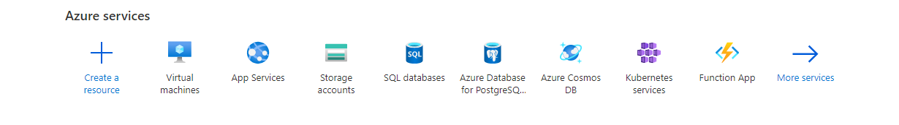
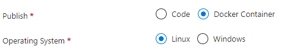
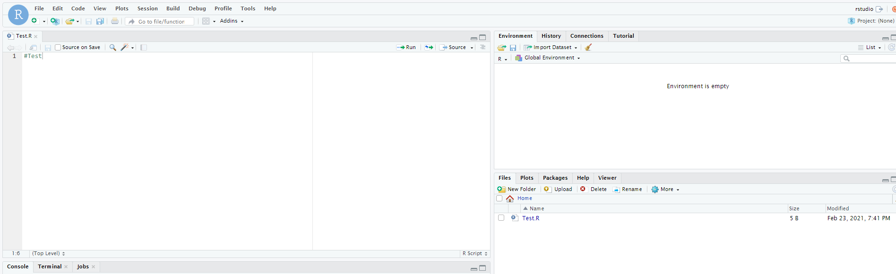

# Docker Containers and Azure

## Moving a local docker Container to Azure

### Prerequisites: 
1. [Azure Account](https://azure.microsoft.com/en-us/free/)
    * [Free Student Credits with Azure](https://azure.microsoft.com/en-us/free/students/)
2. [Azure CLI](https://docs.microsoft.com/en-us/cli/azure/install-azure-cli)
    1. Run the `login` command in the command prompt or terminal: `az login`
    2. Sign in with your account credentials in the browser
4. [Docker Desktop](https://www.docker.com/products/docker-desktop)

### Purpose
The purpose of this guide is to help you pull a generic Docker image, run it on your personal machine, and then access the container remotely after pushing to Azure. You will need to have Docker installed on your local machine and an azure account.

### Create Azure container registry
The first step is to create an Azure container registry. You will then want to enable admin privleges, setup a username and make sure you have access to you password in the access key tab.

1. Create a resource group
      * `myResourceGroup` should be replaced with the name of your rescource group name
```Azure CLI
az group create --name myResourceGroup --location eastus
```

2. Create container registry with [az acr create](https://docs.microsoft.com/en-us/cli/azure/acr#az-acr-create)
      * `<acrName>` should be replaced with a unique name containing 5-50 alphanumeric characters
```Azure CLI
az acr create --resource-group myResourceGroup --name <acrName> --sku Basic
```

3. Log in to container registery
```Azure CLI
az acr login --name <acrName>
```
`<acrName>` is the same name used in previous step
      
**NOTE: After completing step 3, you with need to change the context in which you are running the command prompt or terminal**
      
### Docker on local machine

Pull a container to your  local machine. 
For now, we can use an example container `rocker/rstudio`.

```Docker
docker pull rocker/rstudio
```

Once you have pulled the image it is time to run the container locally. This can be done in one of two ways. In Docker Desktop you may select the image to run as a container or you can run a new container from the command line.

```Docker
docker run -e PASSWORD=12345 -p 8787:8787 rocker/rstudio
```

You should be able to access the running container from [http://localhost:8787](http://localhost:8787) and login with the username 'rstudio' and pasword '12345'

Once the container is running locally you can move on to running the container as a web application hosted on Azure. 

1. Login to the Azure Container Registery created earlier 
```Docker
docker login <acrName>.azurecr.io
```
You will  be prompted to login with the credentials you setup in the container registry. 

2. It is important to rename the container according to the container registry we wish to push to. This allows us to have a smooth transition as we move the container to a remote host.
```Docker
docker tag rocker/rstudio <acrName>.azurecr.io/rocker/rstudio
```

After renaming the container to match the registry you may simply push your image to container registry as follows:
```Docker
docker push <acrName>.azurecr.io/rocker/rstudio
```
Your container should now be visible within your container registry. 

## Accessing your Container

Navigating to your Azure portal you will now want to create a new resource.



We want to select a web application but for the pubblish options select Docker Container.



Then for the image source, you may select Azure Container Registry. Now you should be able to select the registry and image that were pushed earlier. The final step is to create the app. Once your app is created, you should be provided with a link to access your Docker Container which is now hosted on Azure.



## Helpful Links
This guide is intended to be written as an extension of and explanation of this [Guide for pushing a generic container](https://docs.microsoft.com/en-us/azure/container-registry/container-registry-get-started-docker-cli)

[Data Science and Azure](https://towardsdatascience.com/running-jupyter-notebook-on-the-cloud-in-15-mins-azure-79b7797e4ef6)
[Tutorial: Deploy a multi-container group using Docker Compose](https://docs.microsoft.com/en-us/azure/container-instances/tutorial-docker-compose)
