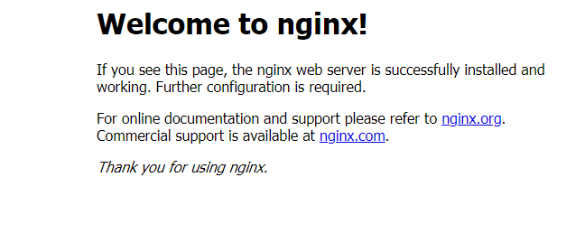

# Docker Containers and Azure

## Moving a local docker Container to Azure

Prerequisites: Azure Account, Docker Desktop, Azure ACI installed

The purpose of this guide is to help you pull a generic Docker image, run it on your personal machine, and then access the container remotely after pushing to Azure. You will need to have Docker installed on your local machine and an azure account.

 The first step is to create an Azure container registry. You will want to enable admin privleges, setup a username and make sure you have acess to you password in the access key tab.

After doing this you can run the following in your command prompt replacing 'myregistry' with the name of your container registry.

```sh
docker login myregistry.azurecr.io
```

You will then be prompted to login with the credentials you setup in the container registry. Now that we are logged in to our container registry we can pull a docker image to our local machine. For now, we can use an example container from Microsoft.

```sh
docker pull rocker/rstudio
```

Once you have pulled the image it is time to run the container locally. This can be done in one of two ways. In Docker Desktop you may select the image to run as a container or you can run a new container from the command line. This can be done as follows:

```sh
docker run -e PASSWORD=12345 -p 8787:8787 rocker/rstudio
```
You should be able to access the running container from [http://localhost:8787](http://localhost:8787)

Now that we have the container running locally we can move on to running the container as a web application hosted on Azure. It is important to rename the container according to the container registry we wish to push to. This allows us to have a smooth transition as we move the container to a remote host.

```sh
docker tag mcr.microsoft.com/oss/nginx/nginx:1.15.5-alpine myregistry.azurecr.io/samples/nginx
```

After renaming the container to match the registry you may simply push your image to container registry as follows:
```sh
docker push myregistry.azurecr.io/samples/nginx
```
Your container should now be visible within your container registry. 

## Accessing your Container

Navigating to your Azure portal you will now want to create a new resource.


We want to select a web application but for the pubblish options select Docker Container.


Then for the image source, you may select Azure Container Registry. Now you should be able to select the registry and image that were pushed earlier. The final step is to create the app. Once your app is created, you should be provided with a link to access your Docker Container which is now hosted on Azure.



## Helpful Links
This guide is intended to be written as an extension of and explanation of this [Guide for pushing a generic container](https://docs.microsoft.com/en-us/azure/container-registry/container-registry-get-started-docker-cli)

[Data Science and Azure](https://towardsdatascience.com/running-jupyter-notebook-on-the-cloud-in-15-mins-azure-79b7797e4ef6)
